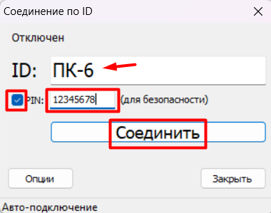
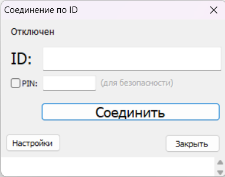
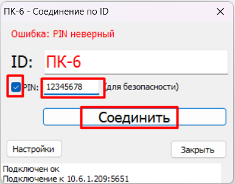

# LiteManager

LiteManager - программа удаленного управления компьютерами через Интернет или администрирования в локальной сети, для технической поддержки учеников, дистанционного обучения, контроля рабочего процесса обучающихся.

Оф.сайт - https://litemanager.org/

# Установка

>   [!NOTE]
> Перед выполнением действий по данной инструкции рекомендуется изменить имя компьютера. Узнать, как это сделать можно тут -> [гайд по смене имени компьютера]()

Любая клиент-серверная программа требует знаний об IP-адресах ПК. Если в вашем учереждении компьютеры имеют конкретные IP (статические), то запросите список IP адресов компьютеро в вашей аудиторииу тех.специалиста.
Если за тех.обслуживание отвечаете вы, то сформируйте в удобном редакторе таблицу из списка рабочих мест(номеров компьютеров) и соответсвующим им статических адресов и держите под рукой.

Сначала мы рассмотрим тот случай, когда не вы отвечаете за организацию локальной сети в вашей организации, и когда IP-адреса постоянно меняются (являются динамическими).

Для примера, в аудитории 11 ноутбуков, подключенных к одной сети (преподавательский - ПК-11, ученические от ПК-1 до ПК-10).

Чтобы организовать связь программы нам потребуется установить на ученические ПК LiteManager Server. А на преподавательский - LiteManager Viewer(для работы с ПК учеников) и NOIP-сервер(для связи ПК без IP).

## Шаг 1
  
### Установка NOIP-сервера на ПК-11(Преподавательский ПК)
  
  Скачайте с официального сайта (https://litemanager.org/) архив с установщиками программ и распакуйте его в любую папку (например в Документы)
  
  
  
  Зайдите в папку "NOIP (ID router)" и запустите исполняемый файл LMNoIpServer.exe
	
  > litemanager_5 -> NOIP (ID router) -> LMNoIpServer.exe
  
  
  
  Установите галочку на параметре "Запускать при старте Windows" и нажмите на кнопку "Запустить"
  
  
  
  После того как статус работы сервера сменится на "активный" нажмите на "OK". 
  
  В трее появится новая иконка 
  
  
  
## Шаг 2
  
### Установка LiteManager Server на ПК-1...ПК-10(Ученический ПК)

  Скачайте с официального сайта (https://litemanager.org/) архив с установщиками программ и распакуйте его в любую папку (например в Документы)
	
  Запустите установочный файл "LiteManager Pro - Server.msi"
	
  > litemanager_5 -> LiteManager Pro - Server.msi
  
  Пройдите процедуру установки программы, согласившись с лицензией, оставив остальные параметры по умолчанию.
  
  В процессе установки появится окно "Безопасность", где нужно ввести новый пароль для доступа к текущему ПК. В простом случае можно установить один и тот же на все ПК учеников.
  Отметьте параметр "Разрешить подключения по ID".
  
  
  
  > [!WARN]
  > В процессе установки могут потребоваться администраторские права
  
  После установки в трее появится иконка
  
  
  
  Нажмите на эту иконку и в появившемся окне нажмите "Опции"
  
  
  
  Снимите галочку с "Использовать общий NOIP-сервер" и укажите IP-адрес ПК, где установлен NOIP-сервер(преподавательский ПК-11). 
  
  
  
  Перейдите на вкладку "Дополнительные" и отметьте "Использовать имя компьютера как ID" и нажмите "ОК"
	
  
  
  Значение в поле ID автоматически сменится на имя текущего компьютера. 
  Рекомендуется поставить галочку напротив поля PIN и указать его значение.
  Затем нажать на "Соединить". Если вы сделали все верно, то статус сменится на "Соединен"
  
  
  
  Повторите этот шаг для всех ученических ПК.
  
## Шаг 3
  
### Установка LiteManager Viewer на ПК-11(Преподавательский ПК)

  В предыдущем шаге на ученических ПК-1...ПК-10 был установлен сервер для подключения и управления ПК.
  На этом требуется установить программу для их удаленного управления на ПК преподавателя.
  
   Запустите установочный файл "LiteManager Pro - Server.msi"
	
  > litemanager_5 -> LiteManager Pro - Server.msi
  
  Пройдите процедуру установки программы, согласившись с лицензией, оставив остальные параметры по умолчанию.
  
  > [!WARN]
  > В процессе установки могут потребоваться администраторские права
  
  После установки появится ярлык приложения, через который можно его запускать
  
  
  
  При первом запуске, необходимо указать приложению IP-адрес NOIP-сервера.
  Пройдите в "Соединение по ID"
  
  > Соединение -> Соединение по ID
  
  
  
  В отрывшемся окне нажмите на "Настройки"
  
  
  
  Перейдите на вкладку "Опции", снимите галочку с "Использовать общий NOIP-сервер", укажите IP-адрес ПК, где установлен NOIP-сервер(преподавательский ПК-11), нажмите "ОК" и закройте окно "Соединение по ID".
  
  
  
## Шаг 4
  
### Подключение в LiteManager Viewer на ПК-11(Преподавательский ПК)
  
  Далее необходимо добавить новые соединения в адресную книгу, для быстрого и удобного соединения с ПК учеников.
  
  Нажмите на иконку "Добавить новое соединение".
  
  
  
  Введите название соединения(например номер ПК или рабочего места), введите пароль для ПК, который мы создавали при установки сервера на подключаемый ПК ученика.
  Отметьте галочки как показано на изображении и укажите ID подключаемого ПК ученика (в нашем случае это имя компьютера) и нажмите на "ОК".
  
  
  
  Совершите двойной клик по появившейся иконке компьютера.
  
  
  
  Введите PIN и нажмите "Соединить"
  
  
  
  Откроется окно отображения экрана удаленного ПК ученика.
  Закройте окно и повторите этот шаг для остальных ученических ПК.
  
## Готово!
  
  Как работать с LiteManager Viewer вы можете узнать тут -> [Обзор функций LiteManager Viewer (LMViewer)]()